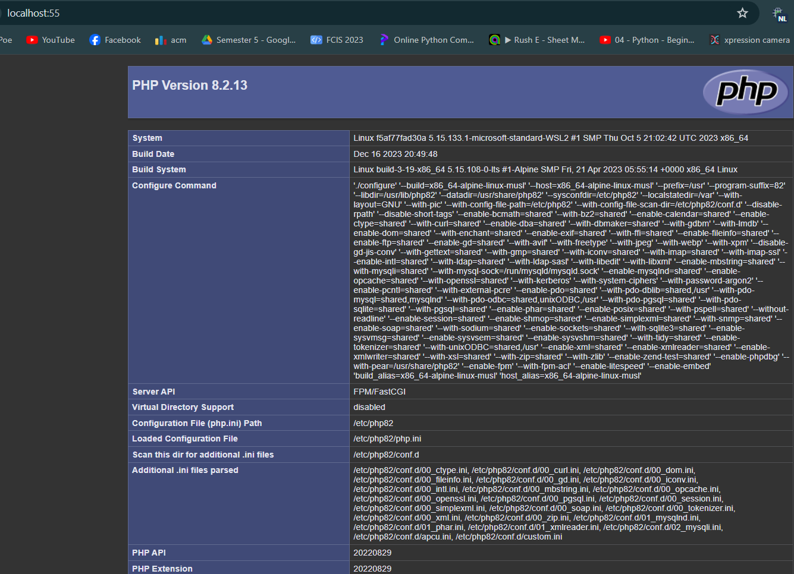

# Task one

## Q1. 4 images
- busybox
- alpine 
- erseco/alpine-php-webserver
- ahmedyasser9/osc-server
```
docker images
```

## Q2. Create a container from alpine and has it print out what is inside /etc/hostname file

```
docker run alpine cat /etc/hostname

```
## Q3. Download ubuntu image with the noble tag

```
docker pull ubuntu:noble
```
## Q4.  Run a container using erseco/alpine-php-webserver image and detach it

```
docker run -dp 8080 erseco/alpine-php-webserver

```
>image


## Q5.  The above image erseco/alpine-php-webserver is a web server that runs on port 8080, how can we map it to port 55 on our host?

```
docker run -dp 55:8080 erseco/alpine-php-webserver

```
## Q6.  Take a screenshot of the page that is loaded when visiting localhost:55 after running the container in Q5



## Q7. Search for the container you ran in Q4 and stop it then delete it


```
docker ps -a
docker stop 8576a
docker rm 8576a
```
